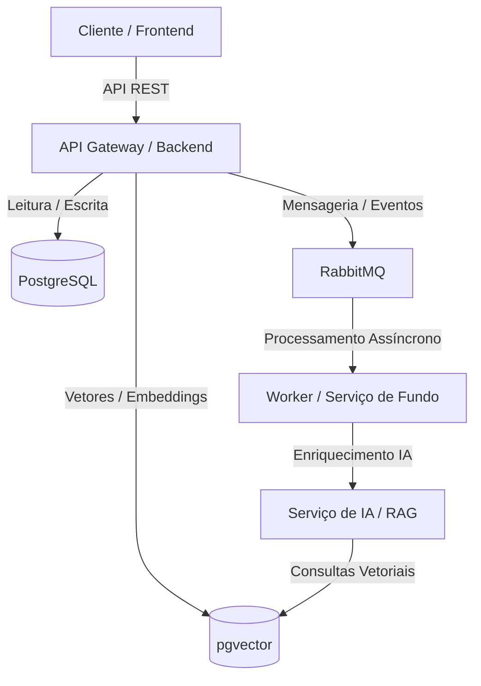
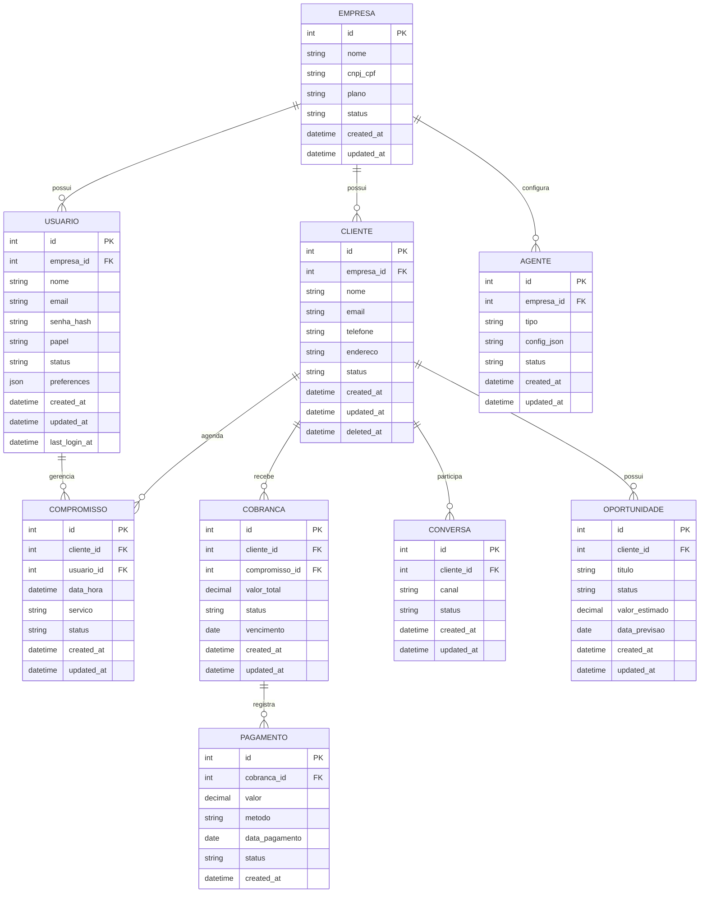

# Especificação Técnica de Sistema: Severina AI

Este documento descreve as especificações técnicas, arquiteturais e funcionais do sistema **Severina AI**. Ele serve como fonte da verdade para o time de desenvolvimento, qualidade e operações (DevOps).

---

## Controle de Versões

| Versão | Data | Autor | Descrição das Alterações |
| :--- | :--- | :--- | :--- |
| 1.0.0 | 2026-07-06 | Analista de Requisitos | Definição inicial da especificação e escopo básico. |

---

## 1. Introdução e Contexto

### 1.1 Objetivo do Sistema

O sistema Severina AI tem como propósito atuar como uma secretária virtual para pequenas empresas, automatizando atendimento, agenda, cobrança, follow-up e geração de insights. Ele resolve o problema de sobrecarga de tarefas administrativas e operacionais que tornam o atendimento inconsistente, aumentam o retrabalho e prejudicam o fluxo de caixa. Os principais beneficiários são micro e pequenas empresas de serviços, pequenos empresários e autônomos que dependem de canais digitais como WhatsApp.

### 1.2 Limites do Sistema (Escopo)

*   **O que está no escopo:**
    * Atendimento omnichannel básico (WhatsApp e web)
    * Cadastro e gestão de clientes
    * Agendamento inteligente de compromissos
    * Cobrança automática e follow-up
    * Dashboard de insights e métricas
    * Gestão de usuários e permissões
    * Multi-tenant lógico com `company_id`

*   **O que está fora do escopo:**
    * Integração nativa com ERPs corporativos
    * Funcionalidades contábeis avançadas
    * Suporte multilíngue completo no MVP
    * Marketplace ou e-commerce completo
    * Gateway de pagamento próprio

### 1.3 Glossário e Definições

*   **Severina AI:** Plataforma de secretária virtual para pequenas empresas.
*   **Atendimento Omnichannel:** suporte a múltiplos canais de contato integrados em um mesmo fluxo.
*   **CRM:** sistema de gerenciamento de relacionamento com clientes.
*   **Follow-up:** acompanhamento automático de clientes após interações ou serviços.
*   **Multi-tenant:** arquitetura que permite múltiplas empresas utilizarem a mesma plataforma com isolamento lógico de dados.
*   **Dark Mode:** modo de exibição com superfícies escuras e texto claro, projetado para reduzir fadiga visual em ambientes de baixa luminosidade.
*   **Preferências de Tema:** configuração do usuário que define o modo de exibição (claro, escuro ou sistema). Persistida em localStorage e sincronizada via API.

---

## 2. Visão Geral da Arquitetura

O sistema é composto por frontend web, API Gateway, microserviços de domínio, banco de dados relacional e mensageria para comunicação assíncrona. O frontend consome APIs REST expostas pelo backend, que centraliza regras de negócio e acessa o banco de dados PostgreSQL. Eventos assíncronos são tratados por mensageria RabbitMQ e serviços de IA utilizam um banco vetorial para recuperação de contexto.



### 2.1 Stack Tecnológica Recomendada

*   **Frontend:** React, Next.js, TypeScript
*   **Backend:** ASP.NET Core 8, C#
*   **Persistência:** PostgreSQL, Redis, pgvector
*   **Infraestrutura / Deploy:** Docker, Kubernetes, Terraform, nuvem pública (Azure/AWS/GCP)

---

## 3. Requisitos Funcionais (RF)

### [RF-001] Cadastro de Empresa
*   **Descrição:** Permitir o registro de empresas no sistema com dados básicos para iniciar a operação.
*   **Atores:** Administrador da Empresa
*   **Critérios de Aceitação:**
    -   [ ] Empresa é criada com nome, CNPJ/CPF, plano e dados de contato.
    -   [ ] Empresa recebe credenciais iniciais para acesso.

### [RF-002] Cadastro de Clientes
*   **Descrição:** Permitir cadastrar, editar e desativar clientes vinculados à empresa.
*   **Atores:** Administrador da Empresa, Usuário Operacional
*   **Critérios de Aceitação:**
    -   [ ] Cliente pode ser associado a agendamentos e cobranças.
    -   [ ] Cliente pode ser desativado sem ser excluído se tiver histórico vinculado.

### [RF-003] Integração WhatsApp
*   **Descrição:** Conectar a plataforma ao WhatsApp para envio e recebimento de mensagens.
*   **Atores:** Administrador da Empresa, Usuário Operacional, Cliente
*   **Critérios de Aceitação:**
    -   [ ] Mensagens recebidas são registradas como conversas.
    -   [ ] Respostas automáticas podem ser enviadas.
    -   [ ] Webhooks de status de entrega são processados.

### [RF-004] Agendamento Inteligente
*   **Descrição:** Criar e gerenciar compromissos com validação de disponibilidade.
*   **Atores:** Usuário Operacional, Cliente
*   **Critérios de Aceitação:**
    -   [ ] Conflitos de horário são evitados.
    -   [ ] Lembretes são enviados automaticamente via WhatsApp e/ou notificação push.

### [RF-005] Cobrança Automática
*   **Descrição:** Gerar cobranças automaticamente a partir de serviços ou compromissos concluídos.
*   **Atores:** Administrador da Empresa, Usuário Financeiro
*   **Critérios de Aceitação:**
    -   [ ] Cobrança é gerada com valor total correto.
    -   [ ] Status de pagamento é atualizado após registro manual ou automático.

### [RF-006] Dashboard de Insights
*   **Descrição:** Exibir indicadores de desempenho de atendimento, agenda e financeiro.
*   **Atores:** Administrador da Empresa, Gestor
*   **Critérios de Aceitação:**
    -   [ ] Indicadores atualizam conforme filtro por período.
    -   [ ] Dados exibidos são restritos à empresa logada.

### [RF-007] CRM de Clientes
*   **Descrição:** Centralizar informações de clientes, histórico de interações, conversas e oportunidades em uma base única.
*   **Atores:** Administrador da Empresa, Usuário Operacional
*   **Critérios de Aceitação:**
    -   [ ] Histórico de conversas e atendimentos é exibido na timeline do cliente.
    -   [ ] Oportunidades podem ser criadas e acompanhadas por status.
    -   [ ] Busca por clientes suporta filtros por nome, telefone e status.

### [RF-008] Preferências de Tema (Dark Mode)
*   **Descrição:** Permitir que o usuário alterne entre modo claro, escuro e sistema, com preferência persistida por conta.
*   **Atores:** Todos os usuários autenticados
*   **Critérios de Aceitação:**
    -   [ ] Toggle de tema está disponível no topbar, próxima ao avatar do usuário.
    -   [ ] Três opções: Claro, Escuro, Sistema (padrão).
    -   [ ] Preferência é persistida em `localStorage` (`severina-theme`) e sincronizada via API.
    -   [ ] Na primeira visita, o tema padrão é `system` (respeita `prefers-color-scheme`).
    -   [ ] Troca de tema é instantânea sem recarregamento da página.
    -   [ ] Acessibilidade garantida: `aria-label="Alternar tema"`, `role="switch"`, `aria-checked`.
    -   [ ] Contraste de cores mantém razão mínima de 4.5:1 em ambos os modos.

---

## 4. Requisitos Não Funcionais (RNF)

| ID | Categoria | Descrição do Requisito | Critério de Medição / Validação |
| :--- | :--- | :--- | :--- |
| **RNF-001** | Desempenho | Latência de requisições de leitura. | 95% das requisições respondidas em < 200ms. |
| **RNF-002** | Segurança | Criptografia de dados sensíveis. | Dados sensíveis encriptados em repouso e em trânsito. |
| **RNF-003** | Disponibilidade | SLA operacional de infraestrutura. | SLA mínimo de 99.9% de uptime anual. |
| **RNF-004** | Escalabilidade | Volume de requisições concorrentes. | Suportar até 1 mil empresa ativa simultaneamente no MVP com auto-scaling ativo. |
| **RNF-005** | Observabilidade | Telemetria e logs estruturados. | Implementação de OpenTelemetry e dashboards de monitoramento. |
| **RNF-006** | Compliance | Conformidade com LGPD. | Política de dados, consentimento granular e auditoria em logs de acesso. |
| **RNF-007** | Testabilidade | Testes automatizados e pipelines CI/CD. | Cobertura mínima de 80% linhas backend e 70% frontend. Testes de unidade, integração e E2E. |
| **RNF-008** | Usabilidade | Acessibilidade e responsividade do frontend. | Conformidade com WCAG 2.1 nível AA. Layout responsivo para desktop e mobile. |
| **RNF-009** | Usabilidade | Modo claro/escuro com preferência por usuário. | Toggle de tema no topbar. Preferência persistida via localStorage + API. Padrão: system. Contraste AA em ambos os modos. Troca instantânea sem reload. |

---

## 5. Arquitetura de Dados (Modelagem Conceitual)

### 5.1 Entidades Principais e Relacionamentos



---

## 6. Integrações e Comunicação (APIs)

### Endpoint: `POST /api/v1/auth/login`
*   **Descrição:** Autentica usuário e retorna tokens JWT.
*   **Payload de Exemplo (JSON):**
    ```json
    {
      "email": "usuario@empresa.com",
      "senha": "SenhaForte123"
    }
    ```
*   **Respostas Esperadas:**
    -   `200 OK`: Retorna accessToken e refreshToken.
    -   `400 Bad Request`: Payload inválido.
    -   `401 Unauthorized`: Credenciais incorretas.

### Endpoint: `POST /api/v1/auth/refresh`
*   **Descrição:** Renova o accessToken usando um refreshToken válido.
*   **Payload de Exemplo (JSON):**
    ```json
    {
      "refreshToken": "eyJhbGciOiJIUzI1NiIs..."
    }
    ```
*   **Respostas Esperadas:**
    -   `200 OK`: Retorna novo accessToken.
    -   `401 Unauthorized`: Refresh token inválido ou expirado.

### Endpoint: `GET /api/v1/companies`
*   **Descrição:** Retorna dados da empresa autenticada.
*   **Respostas Esperadas:**
    -   `200 OK`: Retorna dados da empresa.
    -   `401 Unauthorized`: Token inválido ou ausente.

### Endpoint: `PUT /api/v1/companies`
*   **Descrição:** Atualiza dados da empresa autenticada.
*   **Respostas Esperadas:**
    -   `200 OK`: Empresa atualizada com sucesso.
    -   `400 Bad Request`: Dados inválidos.
    -   `403 Forbidden`: Usuário sem permissão.

### Endpoint: `GET /api/v1/clients`
*   **Descrição:** Lista clientes da empresa autenticada com paginação e filtros.
*   **Query Parameters:** `page`, `pageSize`, `search`, `status`
*   **Respostas Esperadas:**
    -   `200 OK`: Retorna lista paginada de clientes.
    -   `401 Unauthorized`: Token inválido ou ausente.

### Endpoint: `POST /api/v1/clients`
*   **Descrição:** Cria novo cliente vinculado à empresa autenticada.
*   **Payload de Exemplo (JSON):**
    ```json
    {
      "nome": "Maria Silva",
      "email": "maria@email.com",
      "telefone": "+5511999998888",
      "endereco": "Rua Exemplo, 123"
    }
    ```
*   **Respostas Esperadas:**
    -   `201 Created`: Cliente criado com sucesso.
    -   `400 Bad Request`: Dados inválidos.

### Endpoint: `GET /api/v1/clients/{id}`
*   **Descrição:** Retorna detalhes de um cliente específico com histórico de interações.
*   **Respostas Esperadas:**
    -   `200 OK`: Retorna dados do cliente.
    -   `404 Not Found`: Cliente não encontrado.

### Endpoint: `GET /api/v1/appointments`
*   **Descrição:** Lista compromissos da empresa autenticada com paginação.
*   **Query Parameters:** `page`, `pageSize`, `startDate`, `endDate`, `status`
*   **Respostas Esperadas:**
    -   `200 OK`: Retorna lista de compromissos.
    -   `401 Unauthorized`: Token inválido ou ausente.

### Endpoint: `POST /api/v1/appointments`
*   **Descrição:** Cria novo compromisso com validação de disponibilidade.
*   **Payload de Exemplo (JSON):**
    ```json
    {
      "clientId": 123,
      "dateTime": "2026-08-10T14:00:00Z",
      "service": "Manutenção preventiva",
      "durationMinutes": 60
    }
    ```
*   **Respostas Esperadas:**
    -   `201 Created`: Compromisso criado com sucesso.
    -   `400 Bad Request`: Dados inválidos ou conflito de horário.

### Endpoint: `POST /api/v1/invoices`
*   **Descrição:** Cria nova cobrança para um cliente.
*   **Payload de Exemplo (JSON):**
    ```json
    {
      "clientId": 123,
      "appointmentId": 456,
      "amount": 450.00,
      "dueDate": "2026-08-10",
      "description": "Serviço de manutenção"
    }
    ```
*   **Respostas Esperadas:**
    -   `201 Created`: Cobrança criada com sucesso.
    -   `400 Bad Request`: Dados inválidos.
    -   `403 Forbidden`: Usuário sem permissão.

### Endpoint: `GET /api/v1/invoices`
*   **Descrição:** Lista cobranças da empresa autenticada com paginação e filtros.
*   **Query Parameters:** `page`, `pageSize`, `status`, `startDate`, `endDate`
*   **Respostas Esperadas:**
    -   `200 OK`: Retorna lista paginada de cobranças.
    -   `401 Unauthorized`: Token inválido ou ausente.

### Endpoint: `GET /api/v1/analytics/reports`
*   **Descrição:** Retorna indicadores de desempenho filtrados por período.
*   **Query Parameters:** `period` (daily, weekly, monthly), `startDate`, `endDate`
*   **Respostas Esperadas:**
    -   `200 OK`: Retorna relatório com métricas de atendimento, agenda e financeiro.
    -   `401 Unauthorized`: Token inválido ou ausente.

### Endpoint: `GET /api/v1/users/preferences`
*   **Descrição:** Retorna as preferências do usuário autenticado (tema, notificações, etc.).
*   **Respostas Esperadas:**
    -   `200 OK`: Retorna objeto com preferências do usuário.
    -   `401 Unauthorized`: Token inválido ou ausente.

### Endpoint: `PUT /api/v1/users/preferences`
*   **Descrição:** Atualiza as preferências do usuário autenticado.
*   **Payload de Exemplo (JSON):**
    ```json
    {
      "theme": "dark"
    }
    ```
*   **Respostas Esperadas:**
    -   `200 OK`: Preferências atualizadas com sucesso.
    -   `400 Bad Request`: Dados inválidos (theme deve ser "light", "dark" ou "system").
    -   `401 Unauthorized`: Token inválido ou ausente.

### Endpoint: `POST /api/v1/webhooks/whatsapp`
*   **Descrição:** Recebe eventos de webhook do WhatsApp (mensagens, status de entrega).
*   **Respostas Esperadas:**
    -   `200 OK`: Evento processado com sucesso.
    -   `400 Bad Request`: Payload inválido.

---

## 7. Premissas e Restrições Técnicas

*   **Premissa 1:** O usuário final possui acesso à internet estável.
*   **Premissa 2:** Pequenas empresas usam WhatsApp como principal canal de comunicação.
*   **Premissa 3:** A solução será oferecida como SaaS.
*   **Restrição 1:** O sistema deve ser compatível com a LGPD.
*   **Restrição 2:** O MVP deve ser implementado sem suporte multilíngue completo.
*   **Restrição 3:** Não serão suportadas integrações ERP no escopo inicial.

---

## 8. Estratégia de Testes

### 8.1 Níveis de Teste

| Nível | Ferramenta | Escopo |
| :--- | :--- | :--- |
| **Unidade** | xUnit (backend), Jest (frontend) | Funções isoladas, validações de domínio, hooks e utilitários |
| **Integração** | xUnit + TestContainers | Endpoints de API, acesso a banco, mensageria |
| **E2E** | Playwright | Fluxos completos de usuário (cadastro, agendamento, cobrança) |
| **Linter / Estático** | ESLint, dotnet format | Convenções de código, detecção de code smells |

### 8.2 Cobertura Mínima

| Camada | Linhas | Branches |
| :--- | :--- | :--- |
| Backend (C#) | 80% | 70% |
| Frontend (TypeScript) | 70% | 60% |

### 8.3 Critérios de Aceitação de Teste

Toda alteração de regra de negócio deve cobrir:

*   **Happy Path:** fluxo principal esperado funcionando corretamente.
*   **Sad Path:** tratamento de erros, validações e exceções.
*   **Edge Cases:** limites de valores, concorrência e dados inválidos.

### 8.4 Pipeline CI/CD

*   Execução automática de testes de unidade e integração em cada pull request.
*   Verificação de cobertura de código com bloqueio de merge se abaixo do mínimo.
*   Testes E2E executados em ambiente de staging antes de deploy em produção.
