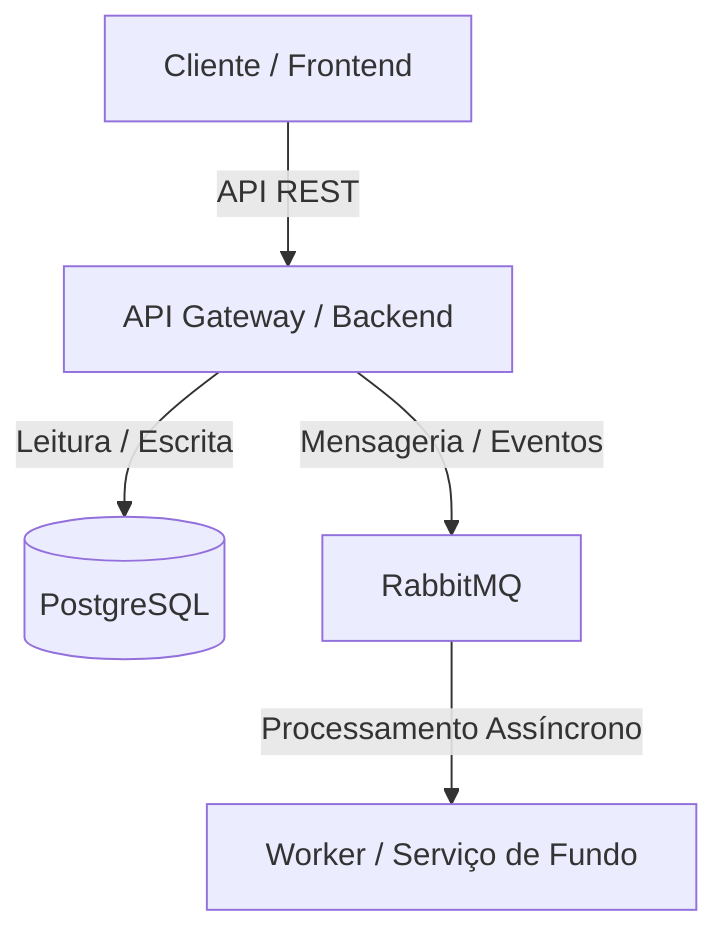
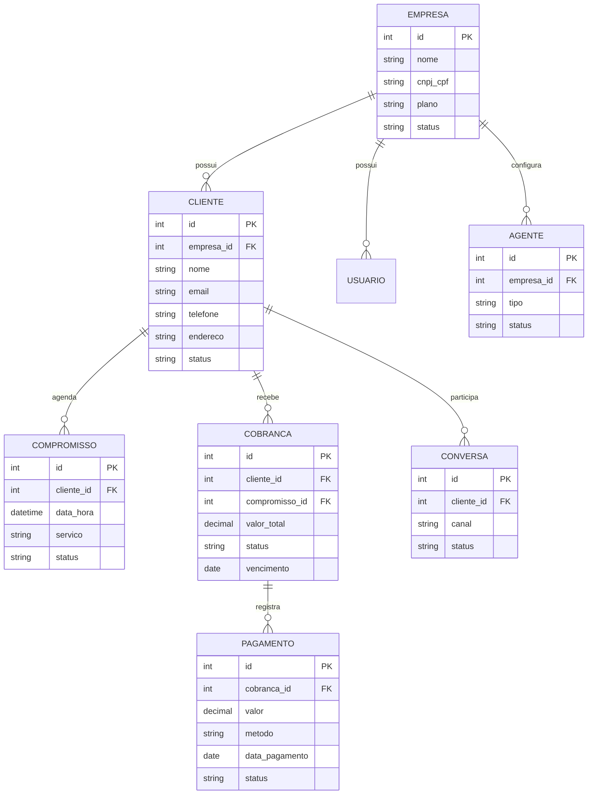

# Especificação Técnica de Sistema: Severina AI

Este documento descreve as especificações técnicas, arquiteturais e funcionais do sistema **Severina AI**. Ele serve como fonte da verdade para o time de desenvolvimento, qualidade e operações (DevOps).

---

## Controle de Versões

| Versão | Data | Autor | Descrição das Alterações |
| :--- | :--- | :--- | :--- |
| 1.0.0 | 2026-07-06 | Analista de Requisitos | Definição inicial da especificação e escopo básico. |

---

## 1. Introdução e Contexto

### 1.1 Objetivo do Sistema

O sistema Severina AI tem como propósito atuar como uma secretária virtual para pequenas empresas, automatizando atendimento, agenda, cobrança, follow-up e geração de insights. Ele resolve o problema de sobrecarga de tarefas administrativas e operacionais que tornam o atendimento inconsistente, aumentam o retrabalho e prejudicam o fluxo de caixa. Os principais beneficiários são micro e pequenas empresas de serviços, pequenos empresários e autônomos que dependem de canais digitais como WhatsApp.

### 1.2 Limites do Sistema (Escopo)

*   **O que está no escopo:**
    * Atendimento omnichannel básico (WhatsApp e web)
    * Cadastro e gestão de clientes
    * Agendamento inteligente de compromissos
    * Cobrança automática e follow-up
    * Dashboard de insights e métricas
    * Gestão de usuários e permissões
    * Multi-tenant lógico com `company_id`

*   **O que está fora do escopo:**
    * Integração nativa com ERPs corporativos
    * Funcionalidades contábeis avançadas
    * Suporte multilíngue completo no MVP
    * Marketplace ou e-commerce completo
    * Gateway de pagamento próprio

### 1.3 Glossário e Definições

*   **Severina AI:** Plataforma de secretária virtual para pequenas empresas.
*   **Atendimento Omnichannel:** suporte a múltiplos canais de contato integrados em um mesmo fluxo.
*   **CRM:** sistema de gerenciamento de relacionamento com clientes.
*   **Follow-up:** acompanhamento automático de clientes após interações ou serviços.
*   **Multi-tenant:** arquitetura que permite múltiplas empresas utilizarem a mesma plataforma com isolamento lógico de dados.

---

## 2. Visão Geral da Arquitetura

O sistema é composto por frontend web, API Gateway, microserviços de domínio, banco de dados relacional e mensageria para comunicação assíncrona. O frontend consome APIs REST expostas pelo backend, que centraliza regras de negócio e acessa o banco de dados PostgreSQL. Eventos assíncronos são tratados por mensageria RabbitMQ e serviços de IA utilizam um banco vetorial para recuperação de contexto.



### 2.1 Stack Tecnológica Recomendada

*   **Frontend:** React, Next.js, TypeScript
*   **Backend:** ASP.NET Core 8, C#
*   **Persistência:** PostgreSQL, Redis, pgvector
*   **Infraestrutura / Deploy:** Docker, Kubernetes, Terraform, nuvem pública (Azure/AWS/GCP)

---

## 3. Requisitos Funcionais (RF)

### [RF-001] Cadastro de Empresa
*   **Descrição:** Permitir o registro de empresas no sistema com dados básicos para iniciar a operação.
*   **Atores:** Administrador, Empresa
*   **Critérios de Aceitação:**
    -   [ ] Empresa é criada com nome, CNPJ/CPF, plano e dados de contato.
    -   [ ] Empresa recebe credenciais iniciais para acesso.

### [RF-002] Cadastro de Clientes
*   **Descrição:** Permitir cadastrar, editar e desativar clientes vinculados à empresa.
*   **Atores:** Administrador, Usuário Operacional
*   **Critérios de Aceitação:**
    -   [ ] Cliente pode ser associado a agendamentos e cobranças.
    -   [ ] Cliente pode ser desativado sem ser excluído se tiver histórico vinculado.

### [RF-003] Integração WhatsApp
*   **Descrição:** Conectar a plataforma ao WhatsApp para envio e recebimento de mensagens.
*   **Atores:** Administrador, Atendente, Cliente
*   **Critérios de Aceitação:**
    -   [ ] Mensagens recebidas são registradas como conversas.
    -   [ ] Respostas automáticas podem ser enviadas.

### [RF-004] Agendamento Inteligente
*   **Descrição:** Criar e gerenciar compromissos com validação de disponibilidade.
*   **Atores:** Atendente, Cliente
*   **Critérios de Aceitação:**
    -   [ ] Conflitos de horário são evitados.
    -   [ ] Lembretes são enviados automaticamente.

### [RF-005] Cobrança Automática
*   **Descrição:** Gerar cobranças automaticamente a partir de serviços ou compromissos concluídos.
*   **Atores:** Administrador, Financeiro
*   **Critérios de Aceitação:**
    -   [ ] Cobrança é gerada com valor total correto.
    -   [ ] Status de pagamento é atualizado após registro manual ou automático.

### [RF-006] Dashboard de Insights
*   **Descrição:** Exibir indicadores de desempenho de atendimento, agenda e financeiro.
*   **Atores:** Administrador, Gestor
*   **Critérios de Aceitação:**
    -   [ ] Indicadores atualizam conforme filtro por período.
    -   [ ] Dados exibidos são restritos à empresa logada.

---

## 4. Requisitos Não Funcionais (RNF)

| ID | Categoria | Descrição do Requisito | Critério de Medição / Validação |
| :--- | :--- | :--- | :--- |
| **RNF-001** | Desempenho | Latência de requisições de leitura. | 95% das requisições respondidas em < 200ms. |
| **RNF-002** | Segurança | Criptografia de dados sensíveis. | Dados sensíveis encriptados em repouso e em trânsito. |
| **RNF-003** | Disponibilidade | SLA operacional de infraestrutura. | SLA mínimo de 99.9% de uptime anual. |
| **RNF-004** | Escalabilidade | Volume de requisições concorrentes. | Suportar até 1 mil empresas ativas simultaneamente no MVP com auto-scaling ativo. |
| **RNF-005** | Observabilidade | Telemetria e logs estruturados. | Implementação de OpenTelemetry e dashboards de monitoramento. |
| **RNF-006** | Compliance | Conformidade com LGPD. | Política de dados e auditoria em logs de acesso. |

---

## 5. Arquitetura de Dados (Modelagem Conceitual)

### 5.1 Entidades Principais e Relacionamentos



---

## 6. Integrações e Comunicação (APIs)

### Endpoint: `POST /api/v1/auth/login`
*   **Descrição:** Autentica usuário e retorna tokens JWT.
*   **Payload de Exemplo (JSON):**
    ```json
    {
      "email": "usuario@empresa.com",
      "senha": "SenhaForte123"
    }
    ```
*   **Respostas Esperadas:**
    -   `200 OK`: Retorna accessToken e refreshToken.
    -   `400 Bad Request`: Payload inválido.
    -   `401 Unauthorized`: Credenciais incorretas.

### Endpoint: `GET /api/v1/appointments`
*   **Descrição:** Lista compromissos da empresa autenticada.
*   **Respostas Esperadas:**
    -   `200 OK`: Retorna lista de compromissos.
    -   `401 Unauthorized`: Token inválido ou ausente.

### Endpoint: `POST /api/v1/invoices`
*   **Descrição:** Cria nova cobrança para um cliente.
*   **Payload de Exemplo (JSON):**
    ```json
    {
      "clientId": 123,
      "amount": 450.00,
      "dueDate": "2026-08-10",
      "description": "Serviço de manutenção"
    }
    ```
*   **Respostas Esperadas:**
    -   `201 Created`: Cobrança criada com sucesso.
    -   `400 Bad Request`: Dados inválidos.
    -   `403 Forbidden`: Usuário sem permissão.

---

## 7. Premissas e Restrições Técnicas

*   **Premissa 1:** O usuário final possui acesso à internet estável.
*   **Premissa 2:** Pequenas empresas usam WhatsApp como principal canal de comunicação.
*   **Premissa 3:** A solução será oferecida como SaaS.
*   **Restrição 1:** O sistema deve ser compatível com a LGPD.
*   **Restrição 2:** O MVP deve ser implementado sem suporte multilíngue completo.
*   **Restrição 3:** Não serão suportadas integrações ERP no escopo inicial.
