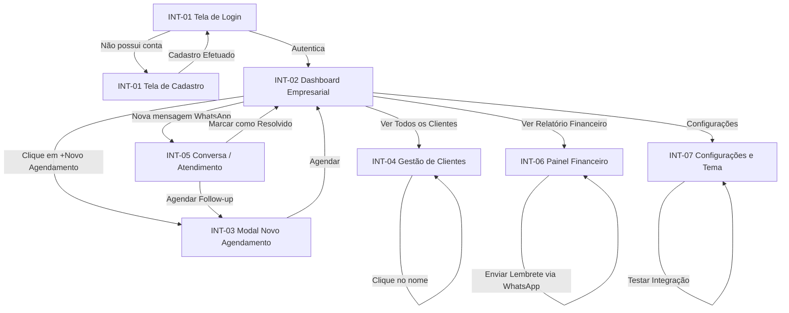

# Especificação de UI - Severina AI: Secretária Virtual Inteligente

## Interfaces gráficas

Esta seção define as telas (interfaces gráficas), componentes de interface e regras de comportamento visual da plataforma Severina AI.

---

### INT-01 - Tela de Login e Cadastro (Autenticação)

- **Tipo de Contêiner**: Página inteira com formulário flutuante centralizado (estilo glassmorphism sobre fundo em gradiente suave de azul escuro para cinza claro).
- **Campos**:
  - *Visão Login*:
    - E-mail (Campo de texto com validação de formato e-mail).
    - Senha (Campo de texto com máscara de ocultação).
  - *Visão Cadastro (Expandido)*:
    - Nome da Empresa (Campo de texto livre).
    - Nome do Usuário (Campo de texto livre).
    - E-mail (Campo de texto com validação de formato e-mail).
    - Senha (Campo de texto com máscara de ocultação e indicador de força).
    - Telefone (Campo numérico formatado com máscara).
    - WhatsApp de Contato (Campo numérico formatado com máscara).
- **Botões**:
  - "Entrar" (Ação principal para submeter credenciais de login, estilo pill verde `{colors.primary}`).
  - "Criar Conta" (Alterna a exibição para o formulário de cadastro, link secundário).
  - "Confirmar Cadastro" (Ação principal para submeter os dados de registro).
  - "Voltar para Login" (Alterna o formulário de volta para o login).
- **Links**:
  - "Esqueci minha senha" (Redireciona para o fluxo de recuperação de e-mail).
  - "Termos de Uso e Política de Privacidade LGPD" (Abre termos em uma janela externa).
- **Considerações**: O formulário deve validar e-mail em tempo real, impedindo o envio caso o formato esteja incorreto. A senha deve exigir mínimo de 8 caracteres com pelo menos uma letra maiúscula, um número e um caractere especial.

---

### INT-02 - Dashboard Empresarial (Visão Marcos)

- **Tipo de Contêiner**: Painel de controle responsivo composto por uma Barra Lateral (Sidebar) fixa à esquerda, Topbar com toggle de tema e avatar do usuário, e uma Área de Conteúdo principal com Grade de Cartões (Grid de Cards) e seção de atividades recentes.
- **Campos**:
  - *Cards de Indicadores (Métricas)*:
    - Atendimentos em Aberto (Exibe quantidade total de conversas ativas).
    - Compromissos Hoje (Exibe quantidade de compromissos do dia corrente).
    - Cobranças Pendentes (Exibe valor total em R$ das cobranças com status pendente ou atrasado).
  - *Seção de Atividades Recentes*:
    - Lista de itens contendo: Tipo de Atividade (Atendimento, Agendamento, Cobrança), Descrição resumida, Data/Hora relativa (ex: "há 5 minutos").
- **Botões**:
  - "+ Novo Agendamento" (Botão destacado de cor verde `{colors.primary}` no topo da página que abre o modal INT-03).
  - "+ Nova Cobrança" (Botão secundário ao lado do botão principal).
  - "Abrir Atendimento" (Ação rápida na lista de atividades recentes, navega para INT-05).
- **Links**:
  - "Ver Todos os Compromissos" (Redireciona para a seção de agenda com visualização expandida).
  - "Ver Todos os Clientes" (Redireciona para INT-04).
  - "Ver Relatório Financeiro" (Redireciona para INT-06).
- **Considerações**: Os cards de indicadores devem exibir variação percentual em relação ao período anterior (seta verde para positivo, vermelha para negativo). A sidebar deve colapsar em telas menores que 768px, transformando-se em menu hamburguer.

---

### INT-03 - Modal de Novo Agendamento

- **Tipo de Contêiner**: Janela modal sobreposta com fundo semitransparente desfocado (backdrop-filter: blur). Painel em vidro levemente esbranquiçado.
- **Campos**:
  - Cliente (Campo de autocomplete que busca na base de clientes cadastrados).
  - Serviço / Tipo de Atendimento (Dropdown com opções: "Consulta", "Manutenção", "Retorno", "Avaliação", "Outro").
  - Data e Hora (DateTime Picker com seleção de data e horário).
  - Canal de Atendimento (Radio buttons: "WhatsApp", "Presencial", "On-line").
  - Observações (Área de texto livre com limite de 300 caracteres).
- **Botões**:
  - "Agendar" (Botão principal verde `{colors.primary}`).
  - "Cancelar" (Fecha o modal descartando as alterações, estilo ghost).
- **Links**:
  - N/A.
- **Considerações**: O DateTime Picker deve bloquear datas retroativas e horários fora do horário comercial configurado pela empresa. Se o horário selecionado conflitar com outro compromisso existente, exibe um alerta amarelo (warning) em destaque abaixo do campo de data/hora: "Atenção: Já existe um compromisso agendado neste horário!". A busca de clientes deve retornar resultados em tempo real com debounce de 300ms.

---

### INT-04 - Gestão de Clientes

- **Tipo de Contêiner**: Tela de listagem com Barra de Pesquisa no topo, filtros laterais e área principal exibindo cards ou tabela de clientes.
- **Campos**:
  - *Barra de Pesquisa*: Campo de busca por nome, telefone ou e-mail.
  - *Filtros*: Status (Dropdown: "Ativos", "Inativos", "Todos"), Último Contato (Filtro por período).
  - *Tabela de Clientes*:
    - Colunas: Nome, Telefone, E-mail, Último Contato, Próximo Compromisso, Status (badge: Ativo em verde, Inativo em cinza).
- **Botões**:
  - "+ Adicionar Cliente" (Botão principal verde no topo da página).
  - "Editar" (Botão ícone em cada linha da tabela).
  - "Abrir Histórico" (Botão secundário que abre painel lateral ou modal com detalhes do cliente).
- **Links**:
  - Nome do cliente (Clica e abre o painel de detalhes com timeline de interações).
  - "Exportar Lista" (Gera CSV dos clientes filtrados).
- **Considerações**: A tabela deve suportar paginação assíncrona com 20 itens por página. Em telas móveis, a tabela deve se transformar em uma lista de cards compactos. O painel de detalhes do cliente exibe uma timeline vertical com todas as interações: conversas, agendamentos e cobranças.

---

### INT-05 - Tela de Conversa / Atendimento Omnichannel (Visão Fernanda)

- **Tipo de Contêiner**: Layout dividido em duas colunas: lista de conversas à esquerda (1/3 da largura) e área de conversa à direita (2/3 da largura).
- **Campos**:
  - *Coluna Esquerda (Lista de Conversas)*:
    - Cabeçalho com título "Atendimentos" e badge com contagem de conversas ativas.
    - Lista de itens com: Avatar do cliente, Nome, Última mensagem (truncada), Data/Hora, Badge de canal (WhatsApp ícone verde, Web ícone azul).
  - *Coluna Direita (Área de Conversa)*:
    - Cabeçalho com nome do cliente, tags de status (badge: "Ativo", "Aguardando", "Resolvido"), botões de ação rápida.
    - Timeline de mensagens com bolhas de conversa: mensagens do cliente à esquerda (fundo `{colors.canvas-muted}`), mensagens da empresa à direita (fundo `{colors.primary-light}`).
    - Campo de entrada de mensagem com ícone de envio e botões de ação rápida.
- **Botões**:
  - "Enviar Mensagem" (Ação principal para enviar resposta).
  - "Marcar como Resolvido" (Fecha a conversa e move para histórico).
  - "Agendar Follow-up" (Abre o modal INT-03 com o cliente já selecionado).
  - "Transferir" (Transfere a conversa para outro usuário da empresa).
- **Links**:
  - "Ver Perfil do Cliente" (Abre INT-04 com detalhe do cliente).
  - "Histórico de Atendimentos" (Exibe conversas anteriores do mesmo cliente).
- **Considerações**: O assistente de IA (Severina) deve sugerir respostas automáticas acima do campo de entrada, com botão "Usar sugestão" que preenche o campo. As mensagens do WhatsApp são exibidas em tempo real via webhooks. A sidebar de conversas deve exibir indicador visual (ponto verde) quando houver novas mensagens não lidas.

---

### INT-06 - Painel Financeiro e Cobranças

- **Tipo de Contêiner**: Painel centralizado dividido em duas seções: cards de indicadores no topo e tabela de cobranças na parte inferior.
- **Campos**:
  - *Cards de Indicadores Financeiros*:
    - Total a Receber (Exibe valor consolidado em R$ de cobranças pendentes).
    - Pagos nos Últimos 30 Dias (Exibe valor total em R$ de pagamentos confirmados no mês).
    - Cobranças Atrasadas (Exibe valor em R$ com badge de alerta vermelho).
  - *Tabela de Cobranças*:
    - Colunas: Cliente, Valor (R$), Data de Vencimento, Status (badge: "Pendente" amarelo, "Pago" verde, "Atrasado" vermelho), Ações.
- **Botões**:
  - "+ Gerar Cobrança" (Botão principal verde que abre formulário de criação de cobrança).
  - "Enviar Lembrete" (Botão secundário habilitado apenas para cobranças com status "Pendente" ou "Atrasado").
  - "Filtrar por Status" (Grupo de botões toggle: "Todos", "Pendentes", "Pagos", "Atrasados").
- **Links**:
  - Nome do cliente na tabela (Abre o painel de detalhes do cliente com histórico financeiro).
  - "Ver Relatório Completo" (Gera relatório em PDF com métricas financeiras do período).
- **Considerações**: Os valores financeiros devem ser exibidos em fonte monoespaçada (JetBrains Mono) para garantir alinhamento vertical nas colunas. O status de cobrança é atualizado automaticamente quando o pagamento é registrado. Lembretes podem ser enviados via WhatsApp diretamente pela interface com uma mensagem pré-configurada editável.

---

### INT-07 - Configurações e Preferências de Tema

- **Tipo de Contêiner**: Tela de configurações com cards agrupados por categoria de preferências.
- **Campos**:
  - *Preferências de Tema*:
    - Toggle de tema (Três opções: "Claro", "Escuro", "Sistema" com ícones sun, moon e monitor).
    - Prévia visual do tema selecionado (miniatura ilustrativa).
  - *Configurações de Notificações*:
    - Toggle: "Notificações por e-mail" (Ativado/Desativado).
    - Toggle: "Notificações push no navegador" (Ativado/Desativado).
    - Toggle: "Alertas de cobrança atrasada" (Ativado/Desativado).
  - *Integrações*:
    - Status da integração WhatsApp (Badge: "Conectado" verde, "Desconectado" vermelho).
    - Botão "Reconectar" (Reinicia o fluxo de autenticação com a API do WhatsApp).
  - *Dados da Empresa*:
    - Nome da Empresa (Campo de texto).
    - CNPJ/CPF (Campo formatado, somente leitura).
    - Telefone de Contato (Campo formatado).
    - Endereço (Campo de texto).
- **Botões**:
  - "Salvar Preferências" (Salva todas as alterações de configuração).
  - "Testar Integração WhatsApp" (Envia mensagem de teste para o número configurado).
  - "Desativar Conta" (Abre modal de confirmação com aviso de dados que serão preservados).
- **Links**:
  - "Gerenciar Usuários" (Abre tela de gestão de usuários da empresa — disponível apenas para perfil Administrador).
  - "Ver Logs de Auditoria" (Exibe registros de operações realizadas na conta).
- **Considerações**: A alteração de tema deve ser instantânea sem recarregamento da página, aplicando CSS custom properties via atributo `data-theme`. A preferência deve ser persistida em `localStorage` (`severina-theme`) e sincronizada via API (`PUT /api/v1/users/preferences`). Na primeira visita, o tema padrão é `system` (respeita `prefers-color-scheme` do SO). O toggle de tema deve ser acessível: `aria-label="Alternar tema"`, `role="switch"`, `aria-checked`.

---

## Fluxo de Navegação

O fluxo de navegação do Severina AI é organizado de forma a garantir jornadas eficientes e com o menor número possível de cliques para as três personas (Empreendedor Autônomo, Gestora de Pequena Empresa e Administrador da Plataforma). Abaixo estão detalhados os caminhos de navegação passo a passo, além do mapeamento visual do sistema.

### 1. Fluxo do Empreendedor Autônomo (Marcos Pereira)

1.  **Entrada e Login**: O usuário acessa a tela de autenticação (`INT-01`), insere as credenciais e entra no sistema.
2.  **Visualização do Painel**: É direcionado para o Dashboard Empresarial (`INT-02`), onde visualiza seus cartões de indicadores (atendimentos abertos, compromissos do dia, cobranças pendentes) e a lista de atividades recentes.
3.  **Fluxo de Criação de Agendamento**:
    - Marcos clica no botão **"+ Novo Agendamento"** no Dashboard (`INT-02`).
    - O sistema abre o Modal de Agendamento (`INT-03`) em sobreposição.
    - Marcos seleciona o cliente (ou busca pelo nome), escolhe o serviço, data, horário e canal de atendimento.
    - Clica em **"Agendar"**.
    - O modal fecha, e o novo compromisso aparece na seção de Atividades Recentes do Dashboard com status "Confirmado".
4.  **Fluxo de Atendimento ao Cliente**:
    - Quando um cliente envia uma mensagem via WhatsApp, uma nova conversa aparece na sidebar com indicador de mensagem não lida.
    - Marcos clica na conversa e é redirecionado para a tela de Atendimento (`INT-05`).
    - A Severina IA sugere uma resposta automática. Marcos pode usar a sugestão, editar ou digitar uma resposta manualmente.
    - Após resolver o atendimento, Marcos clica em **"Marcar como Resolvido"** e, se necessário, agenda um follow-up.

---

### 2. Fluxo da Gestora de Pequena Empresa (Fernanda Costa)

1.  **Entrada e Login**: Fernanda acessa a tela de autenticação (`INT-01`), autentica-se e é direcionada ao Dashboard Empresarial (`INT-02`).
2.  **Gestão de Clientes**:
    - Fernanda clica em "Ver Todos os Clientes" no Dashboard ou acessa a seção de Clientes na sidebar.
    - É redirecionada para a tela de Gestão de Clientes (`INT-04`).
    - Utiliza a barra de pesquisa para encontrar um cliente específico ou aplica filtros por status.
    - Clica no nome do cliente para visualizar o painel de detalhes com timeline completa de interações.
3.  **Fluxo de Cobrança e Financeiro**:
    - Fernanda acessa o Painel Financeiro (`INT-06`) via sidebar ou link no Dashboard.
    - Visualiza os indicadores financeiros (total a receber, pagos, atrasados).
    - Para uma cobrança pendente ou atrasada, clica em **"Enviar Lembrete"**.
    - A Severina envia automaticamente uma mensagem de lembrete via WhatsApp para o cliente.
    - O status da cobrança é atualizado automaticamente quando o pagamento é registrado.
4.  **Configurações de Tema**:
    - Fernanda clica no avatar no topbar e acessa "Configurações" (`INT-07`).
    - Alterna o tema para "Escuro" usando o toggle.
    - O tema é aplicado instantaneamente e a preferência é salva.

---

### 3. Fluxo do Administrador da Plataforma (Rafael Santos)

1.  **Entrada e Login**: Rafael acessa a tela de autenticação (`INT-01`), autentica-se como administrador e entra no Dashboard Empresarial (`INT-02`).
2.  **Monitoramento e Auditoria**:
    - Rafael visualiza os painéis gerais de indicadores da empresa.
    - Acessa a seção de Configurações (`INT-07`) e clica em "Ver Logs de Auditoria" para inspecionar registros históricos de operações (criação, agendamento, cobrança, atendimento).
    - Utiliza filtros por período para auditar operações críticas.
3.  **Gestão de Integrações**:
    - Na tela de Configurações (`INT-07`), Rafael verifica o status da integração WhatsApp.
    - Caso desconectado, clica em **"Reconectar"** para reiniciar o fluxo de autenticação com a API do WhatsApp Business.
    - Utiliza **"Testar Integração"** para enviar uma mensagem de teste e validar o funcionamento.

---

### INT-16 - Tela de Aceite de Convite

- **Tipo de Contêiner**: Página inteira com formulário centralizado sobre fundo neutro.
- **Campos**:
  - Seu Nome (Campo de texto livre, obrigatório).
  - Crie sua Senha (Campo de texto com máscara de ocultação, mínimo 8 caracteres).
  - Confirme sua Senha (Campo de texto com máscara de ocultação).
- **Botões**:
  - "Aceitar Convite" (Ação principal verde `{colors.primary}` para submeter o formulário).
  - "Voltar para o Login" (Link secundário que navega para `/login`).
- **Comportamento**:
  - Ao acessar `/convite/{code}`, o sistema valida o código automaticamente.
  - Se o código for inválido ou expirado, exibe mensagem de erro com link para o login.
  - Se o código for válido, exibe o formulário de aceite.
  - Após envio bem-sucedido, redireciona para `/login` com mensagem de sucesso.
  - Valida que as senhas coincidem antes de enviar.
- **Considerações**: A página deve ser acessível diretamente via link no email, sem necessidade de autenticação. O formulário deve exibir "Mínimo de 8 caracteres" como ajuda abaixo do campo de senha.

---

### Mapeamento Visual do Fluxo

---

## Diretrizes para IA

Ao gerar código frontend, layouts ou estilizações para o Severina AI, os modelos de IA devem cumprir as seguintes regras imperativas de design:

1. **Paleta de Cores Coesa (Azul Profissional & Verde de Ação)**:
   - *Cor Primária*: `#2563eb` (Azul interativo universal — links, botões primary, focus ring, badges ativos. Todo "clica aqui" é azul).
   - *Cor Primária Hover*: `#1d4ed8` (Estado hover de todos os elementos primary).
   - *Cor Primária Focus*: `#3b82f6` (Anel de foco por teclado: `outline: 2px solid`).
   - *Cor de Destaque/Status Sucesso*: `#16a34a` (Verde para estados positivos, pagos, confirmados).
   - *Cor de Aviso*: `#d97706` (Amarelo/âmbar para pendências e alertas).
   - *Cor de Erro*: `#dc2626` (Vermelho para erros, cobranças atrasadas).
   - *Cor de Fundo Claro*: `#ffffff` (Canvas dominante); `#f8fafc` (Sidebar e áreas de suporte); `#f1f5f9` (Estados vazios e skeletons).
   - *Modo Escuro*: `#0f1117` (Canvas); `#1e2128` (Cards); `#252830` (Elevated surfaces).
2. **Design System Minimalista**: Utilizar o design system definido em `design.md` como fonte única de verdade para tokens de cor, tipografia, espaçamento, elevation, shapes e componentes. Nunca inventar novos tokens — sempre referenciar `{colors.*}`, `{typography.*}`, `{spacing.*}`, `{rounded.*}` e `{component.*}`.
3. **Tipografia Modernizada**: Utilizar a fonte do Google Fonts `Inter` como padrão em todo o CSS, com hierarquias de cabeçalho bem definidas (pesos de 500 para títulos normais, 600 para títulos principais e 400 para textos). Usar `JetBrains Mono` para valores financeiros e IDs.
4. **Responsividade**: Layouts de Dashboards (`INT-02`) e Gestão de Clientes (`INT-04`) devem se reorganizar para coluna única em telas móveis. O menu lateral (Sidebar) deve se transformar em um menu hamburguer colapsável em resoluções inferiores a `768px`. Tabelas devem se transformar em lista de cards em mobile.
5. **Acessibilidade WCAG 2.1 AA**: Todos os botões e links de navegação devem conter identificadores únicos e explícitos (`id` e `aria-label`). A relação de contraste de cores entre textos e fundos deve ser mantida sempre em 4.5:1 ou superior em ambos os modos (claro e escuro). Toggle de tema deve usar `role="switch"` e `aria-checked`.
6. **Modo Claro e Escuro**: Suporte obrigatório a modo claro, escuro e sistema. O accent `{colors.primary}` nunca muda entre temas — é a âncora visual. Transição suave: `transition: background-color 0.2s ease, color 0.2s ease` nos elementos que mudam de cor. CSS custom properties no `:root` (light) e `[data-theme="dark"]` (dark).
7. **Componentes Reutilizáveis**: Utilizar os componentes do design system: `button-primary`, `button-secondary`, `button-ghost`, `card`, `card-stat`, `table`, `badge`, `input`, `select`, `modal`, `toast`, `sidebar`, `topbar`, `breadcrumb`, `tabs`. Nunca criar variações de componente sem referenciar o design system existente.
8. **Transições e Micro-animações**:
   - Botões principais devem possuir transição de hover suave (`transition: all 0.3s ease`).
   - Cards de indicadores devem usar animação sutil de fade-in ao carregar a tela.
   - O estado active/pressed de botões usa `transform: scale(0.98)` como micro-interaction padrão.
   - Respeitar `prefers-reduced-motion` para usuários com sensibilidade a movimento.
